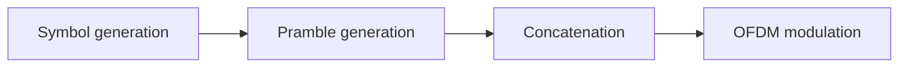
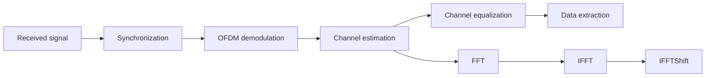

# OFDM for a communication and radar system

## Introduction

Orthogonal Frequency Division Multiplexing (OFDM) is a modulation technique that uses multiple subcarriers to transmit data. The available bandwidth is divided into multiple subcarriers, each of which is modulated using a low-rate data stream. The resulting signals are combined to form the OFDM signal. The key feature of OFDM is that the subcarriers are orthogonal to each other, which means that they do not interfere with each other.

## Transmitter

The transmitter is responsible for modulating the data stream and transmitting the signal.



### Signal generation

The signal before the OFDM modulation is a matrix of symbols. Each row of the matrix corresponds to a time instant, and each column corresponds to a subcarrier.

Each symbol is a complex number, which is chosen from a constellation. The constellation can be BPSK, QPSK or 16-QAM. These complex numbers can be converted to a binary stream using Gray coding, which is a coding scheme that minimizes the number of bit errors when the signal is corrupted.

For now, we will consider that the symbols are generated randomly, and that some of them are known to the receiver (preamble and pilot symbols). The matrix can be represented as follows, where $N_{sc}$ is the number of subcarriers and $P$ is the number of symbols.

```txt
<--------------------- N_sc ----------------------> (freq)

|----|----|----|----|----|----|----|----|----|----| ^
| Pr | Pr | Pr | Pr | Pr | Pr | Pr | Pr | Pr | Pr | |
|----|----|----|----|----|----|----|----|----|----| |
| Pi | Pi | Pi | Pi | Pi | Pi | Pi | Pi | Pi | Pi | |
|----|----|----|----|----|----|----|----|----|----| |
| Da | Da | Da | Da | Da | Da | Da | Da | Da | Da | |
|----|----|----|----|----|----|----|----|----|----| |
| Da | Da | Da | Da | Da | Da | Da | Da | Da | Da | P+1
|----|----|----|----|----|----|----|----|----|----| |
| Pi | Pi | Pi | Pi | Pi | Pi | Pi | Pi | Pi | Pi | |
|----|----|----|----|----|----|----|----|----|----| |
| Da | Da | Da | Da | Da | Da | Da | Da | Da | Da | |
|----|----|----|----|----|----|----|----|----|----| |
| Da | Da | Da | Da | Da | Da | Da | Da | Da | Da | |
|----|----|----|----|----|----|----|----|----|----| v
                                                    (time)
```

Where:

- `Pr`: Preamble symbol
- `Pi`: Pilot symbol
- `Da`: Data symbol

The number of pilots symbols can be defined by the user by tweaking the $N_t$ and $N_f$ parameters. There will be, in the matrix above, $1/N_f$ pilot symbols per row, and $1/N_t$ pilot symbols per column, meaning that if $N_f$ and $N_t$ are equal to 1, there will only be one pilot symbol in the matrix.

### OFDM modulation

The OFDM modulation has the following steps:


#### Oversampling

The OFDM signal is oversampled by inserting zeros at the end of each row of the matrix. The oversampling factor is $L$. The matrix has now $N_{sc} \times  L$ columns, and $P+1$ rows. These zeros are inserted such that, when it will enter the IFFT block, the resulting signal will be interpolated by a sync function.

#### IFFT

The IFFT block takes the matrix of symbols and computes the Inverse Fast Fourier Transform (IFFT) of each row. The IFFT is computed on each row of the matrix, and the resulting signal is a time-domain signal.

#### Normalization

The signal is normalized by dividing it by the square root of the number of subcarriers $N_{sc}$ times the oversampling factor $L$.

#### Cyclic prefix addition

The cyclic prefix is added to the signal. The cyclic prefix is a copy of the last $L_{cp}$ samples of the signal, where $L_{cp}$ is the length of the cyclic prefix. The cyclic prefix is added to the beginning of the signal.

#### Reshaping

The signal is reshaped into a vector of complex numbers. The resulting signal is the OFDM signal that will be transmitted.

### Signal transmission

The final OFDM signal can be represented as follows:

```txt
|-----------|------------------------------------|
|  Preamble | Pilot | Data | Data | Pilot | Data |
|-----------|------------------------------------|
```

This signal is transmitted continuously by the USRP transmitter device. It is transmitted over the air, and the receiver will capture it.

## Receiver

The receiver is responsible for demodulating the received signal, extracting the data and create the Doppler map.

By design, the receiver will capture a signal with a length of 2 times the length of the transmitted signal. This guarantees that the receiver will capture the entire transmitted signal, from its beginning to its end at least once.



### Synchronization

The synchronization block is responsible for synchronizing the received signal with the transmitter. It uses the preamble symbols, known to the receiver, to find the beginning of the OFDM signal. It is thus a **time-domain synchronization**.

For that, the synchronization block will correlate the received signal with the preamble symbols. The correlation will give the position of the preamble in the received signal. The synchronization block will then remove the samples before the preamble.

### OFDM demodulation

The OFDM demodulation has the following steps:


#### Reshaping

The received signal is first truncated to the length of the transmitted signal, defined as $P \times L \times (L_{cp} + N_{sc})$. The signal is then reshaped into a matrix of complex numbers.

#### FFT

The FFT block takes the matrix of symbols and computes the Fast Fourier Transform (FFT) of each row. The FFT is computed on each row of the matrix, and the resulting signal is a frequency-domain signal.

#### Normalization

The signal is normalized by multiplying it by the 1 over the square root of the number of subcarriers $N_{sc}$ times the oversampling factor $L$.

#### Cyclic prefix removal

The cyclic prefix is removed from the signal, by keeping only the last $N_{sc}$ samples of each row.

### Channel estimation

The channel estimation block is responsible for estimating the channel response, which is the response of the channel to the transmitted signal.

A received signal $Y$ can be expressed as
$$Y = H \times X + N$$
where $H$ is the channel response, $X$ is the transmitted signal and $N$ is the noise added by the channel. At the receiver side, the transmitted signal $X$ can be separted in two parts: the known part $X_{\text{p}}$ (pilots), and the unknown part $X_{\text{d}}$ (data). The channel estimation block will first estimate the channel response $H$ using the known part of the transmitted signal as:
$$\hat{H} = Y_{\text{p}} / X_{\text{p}}$$

Since we want to estimate the channel response for each point of the received signal, we will interpolate the estimated channel response (known at the pilot points) to the entire received signal.

### Channel equalization (communication only)

The channel equalization block is responsible for equalizing the channel response. This is done by dividing the received signal by the estimated channel response. Indeed, to recover the transmitted signal $X$, we can use the estimated channel response $\hat{H}$ as:
$$\hat{X_D} = Y_D / \hat{H}$$

:point_up: For now, the channel equalization is applied to the entire received signal. In a real-world scenario, the channel equalization would be applied to the data symbols only.

### Data extraction (communication only)

The data extraction block is responsible for extracting the data from the received signal.

:point_up: For now, pilots and data symbols are converted to binary streams using Gray decoding. In a real-world scenario, the pilots would be removed from the received signal, and the data symbols would be converted to binary streams.

### Doppler map creation (radar only)

The Doppler map creation block is responsible for creating the Doppler map. The goal is to "visualize" the channel response and map it from the time-frequency domain to the distance-speed domain.

The Doppler map is created by computing the FFT of the channel response along the frequency axis. Then an IFFT is applied along the time axis. Finally, an IFFTSift is applied to the resulting signal.

It results in a Doppler map, where the x-axis is the distance and the y-axis is the speed.
